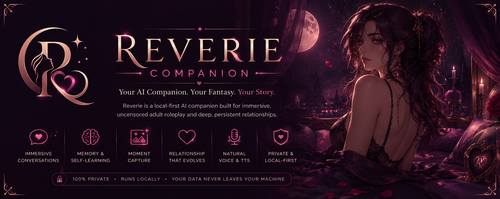

# Reverie Companion

**Your AI companion. Your fantasy. Your story.**

Reverie is a local-first desktop AI companion for immersive adult roleplay, persistent character continuity, memory-linked visual presence, emotional voice, and transparent self-learning. It is built as a custom FastAPI + Tauri/Svelte application rather than a SillyTavern skin, with local storage and 8GB-VRAM-aware media orchestration as core design constraints.

> A private local companion who remembers what matters, stays visually and emotionally recognizable, grows from shared history, and keeps the user in control.

---

## Current State

**Status:** Milestones 1-6 are complete. The current engineering handoff is **Milestone 7 - Companion Genesis Immersive Creator**.

M6 closed the basic character creator foundation: Reverie can now persist creator drafts separately from finalized characters, validate drafts through runtime `CharacterBlueprint` structures, preview greetings and example dialogue, queue draft first-portrait Moment Capture, review/finalize drafts, duplicate drafts or characters, and import/export/delete character-level data through versioned management envelopes.

M7 is the presentation and experience layer on top of that foundation. It should turn the practical draft system into the immersive Companion Genesis creator without inventing unsupported fields or implying runtime powers that do not exist yet.

---

## What Reverie Can Do Today

- **Local chat runtime:** FastAPI backend with Ollama chat, streaming SSE responses, health diagnostics, bounded prompt context, and selected-character grounding.
- **Character runtime:** versioned `CharacterBlueprint` persistence, selected-character chat, relationship state, visual identity, roleplay-first policies, prompt compilation, and character-scoped memory/reflection hooks.
- **Basic creator foundation:** `CharacterCreatorDraft` persistence, draft validation, draft-to-blueprint previews, deterministic greeting/example dialogue previews, `PreviewQualityReport`, draft first-portrait Moment Capture, review/finalize, duplicate, import/export, and confirmation-gated finalized-character delete flows.
- **Long-term memory:** local LanceDB-backed memory with Ollama embeddings, character/global/shared scoping, bounded retrieval, optional mem0 write-through, and local-first deletion/control posture.
- **Reflection and growth:** private self-reflection journal entries, growth orchestration, rare growth notifications, Personal LoRA candidate collection/review hooks, and conservative local training-job foundations.
- **Moment Capture and visual continuity:** character-aware image/capture requests, `VisualPromptCompiler`, character-linked gallery metadata, quick/detailed visual feedback, reviewable `VisualChangeEvent` canon proposals, approve/reject/rollback controls, visual memory writeback, and deterministic visual consistency evals.
- **8GB-aware media scheduling:** queued/cancellable image capture jobs, TTS priority, safe downgrade behavior under low/unknown VRAM, preserved retry/cancel/failure metadata, and non-blocking chat.
- **Frontend shell:** Tauri 2 + SvelteKit desktop UI with Chat, Characters, Visual Novel, TTS, Images/Moment Capture, Growth, Journal, Memory, Training, Encyclopedia, Settings, and warm local-first styling.
- **Extensibility foundation:** typed extension manifests, declarative settings sections, bounded event history, and backend/frontend contracts for future integrations.

---

## Tech Stack and Model Inventory

Reverie's current local stack is FastAPI + Ollama + LanceDB on the backend,
SvelteKit 2/Svelte 5 + Tauri 2 on the frontend, Orpheus-CPP with Piper fallback
for voice, and ComfyUI for local image generation. The canonical model inventory is
kept in [Tech Stack and Model Inventory](docs/TECH_STACK_MODELS.md).

Current required/default models:

| Purpose | Current default | Runtime |
|---|---|---|
| Chat LLM | `llama3.1:8b` | Ollama |
| Memory embeddings | `nomic-embed-text` | Ollama |
| Memory extraction/reflection LLM | Reuses `llama3.1:8b` unless `REVERIE_MEMORY_LLM_MODEL` is set | Ollama |
| Primary TTS | Orpheus `orpheus-3b-0.1-ft-q4_k_m.gguf` | `orpheus-cpp` CPU backend |
| TTS fallback | Piper `en_US-lessac-medium.onnx`, stored as `reverie_default.onnx` | `piper-tts` CPU backend |
| Image generation | `Comfy-Org/flux1-schnell` file `flux1-schnell-fp8.safetensors` | ComfyUI |

Optional and lineage model references are documented in the inventory: Orpheus
source model `canopylabs/orpheus-3b-0.1-ft`, SNAC decoder
`onnx-community/snac_24khz-ONNX`, Flux Schnell GGUF
`flux1-schnell-Q4_0.gguf`, Flux text encoders `clip_l.safetensors` and
`t5xxl_fp8_e4m3fn.safetensors`, and the legacy SD 1.5 preview workflow
checkpoint `v1-5-pruned-emaonly.safetensors`.

---

## Current Focus

The next milestone is **M7 - Companion Genesis Immersive Creator**.

M7 should provide:

- immersive creator architecture and stage shell;
- starfield/celestial visual system with reduced-motion support;
- choice-card/constellation style creator controls;
- live companion preview surfaces based on the M6 draft preview contracts;
- multi-draft compare/mix workflows;
- first-portrait validation ceremony using the existing Moment Capture stack;
- world reveal and final begin/save experience;
- creator accessibility and performance polish.

The implementation rule remains:

```text
Expose only what Reverie can store, consume, preview, validate or correct, and preserve.
```

---

## Architecture

```text
Reverie-Companion/
+-- backend/      FastAPI services, local persistence, memory, growth, characters, capture
+-- frontend/     Tauri 2 + SvelteKit desktop application
+-- docs/         implementation notes, creator draft system docs, smoke checklists
+-- prompts/      Grok/Codex workflow prompts and project skill prompts
+-- tests/        project-level tests
```

### Backend

- Python 3.11+ FastAPI app.
- Ollama for local chat and embeddings.
- SQLite repositories for characters and creator drafts.
- Embedded LanceDB for local memory.
- Modular services for chat, character runtime, creator drafts, Moment Capture, image jobs, reflection, growth, and Personal LoRA review.

### Frontend

- Tauri 2 desktop shell.
- SvelteKit + Svelte 5 UI.
- Component/stores split for chat, characters, images/capture, journal, growth, memory, settings, TTS, and Visual Novel mode.
- Vite dev server on Tauri's fixed port.

---

## Setup

### Backend

```bash
cd backend
python -m venv .venv
source .venv/bin/activate
pip install -r requirements.txt
cp .env.example .env
uvicorn app.main:app --reload
```

Pull the default local models if needed:

```bash
ollama pull llama3.1:8b
ollama pull nomic-embed-text
```

The API runs at `http://localhost:8000` by default.

### Frontend

```bash
cd frontend
npm install
npm run dev
```

For the full desktop app:

```bash
cd frontend
npm run tauri dev
```

---

## Useful Commands

Backend tests:

```bash
cd backend
python -m pytest
```

Visual consistency eval harness:

```bash
cd backend
python -m pytest tests/test_visual_consistency_evals.py -q
```

Frontend checks and tests:

```bash
cd frontend
npm run check
npm run test
```

Frontend build:

```bash
cd frontend
npm run build
```

---

## Roleplay Philosophy

Reverie is a roleplay companion first. Fictional adult fantasy should stay in-character by default, including dark romance, power exchange, fantasy violence, villain arcs, and other user-chosen fictional scenarios.

The hard product boundary is:

```text
18+ only. No underage sexual content. No deliberately childlike sexual presentation.
```

The goal is believable character integrity, not moralizing interruption: characters can disagree, tease, resist, negotiate, set boundaries, and honor OOC/safeword controls while preserving immersion.

---

## Documentation

Core docs:

- [Source of Truth](Reverie_Source_of_Truth.md)
- [Development Plan](DEVELOPMENT_PLAN.md)
- [Creator Draft System](docs/creator-draft-system.md)
- [Character Creator Capability Matrix](CHARACTER_CREATOR_CAPABILITY_MATRIX.md)
- [Roleplay-First Character Integrity Policy](ROLEPLAY_FIRST_CHARACTER_INTEGRITY_POLICY.md)
- [Installation Guide](docs/INSTALLATION_GUIDE.md)
- [Tech Stack and Model Inventory](docs/TECH_STACK_MODELS.md)
- [ComfyUI Setup](docs/COMFYUI_SETUP.md)
- [TTS Setup](docs/TTS_SETUP.md)
- [Backend README](backend/README.md)
- [Frontend README](frontend/README.md)

Workflow and implementation prompts:

- [Global Coding Prompt](prompts/GLOBAL_CODING_PROMPT.md)
- [Grok Coding Director Workflow](prompts/GROK_CODING_DIRECTOR_WORKFLOW.md)
- [Character Runtime & Creator](prompts/skills/character-runtime-creator.md)
- [Roleplay-First Character Integrity](prompts/skills/roleplay-character-integrity.md)
- [Moment Capture & Visual Continuity](prompts/skills/moment-capture-visual-continuity.md)
- [Companion Genesis UX](prompts/skills/companion-genesis-ux.md)
- [Character Quality Evals](prompts/skills/character-quality-evals.md)
- [Memory/RAG System](prompts/skills/memory-rag-system.md)
- [Self-Learning Growth](prompts/skills/self-learning-growth.md)
- [Self-Reflection Journal](prompts/skills/self-reflection-journal.md)
- [8GB VRAM Optimization](prompts/skills/8gb-vram-optimization.md)
- [8GB Local AI Patterns](prompts/skills/8gb-local-ai-patterns.md)
- [Tauri/Svelte UI Patterns](prompts/skills/tauri-svelte-ui-patterns.md)
- [FastAPI Backend Patterns](prompts/skills/fastapi-backend-patterns.md)
- [Futa-Vision Integration](prompts/skills/futavision-integration.md)

---

## Milestone Status

- Complete: **Milestone 1 - Foundation**
- Complete: **Milestone 2 - Memory & Self-Learning**
- Complete: **Milestone 3 - Immersion & Production Foundations**
- Complete: **Milestone 4 - Character Runtime & Capability Alignment**
- Complete: **Milestone 5 - Moment Capture & Visual Continuity**
- Complete: **Milestone 6 - Basic Character Creator Foundation**
- Current handoff: **Milestone 7 - Companion Genesis Immersive Creator**

---

## Development Workflow

Reverie uses a two-run implementation workflow:

1. Grok acts as Coding Director and writes one detailed implementation prompt.
2. The same prompt is run twice in Codex as Run A and Run B.
3. Each run produces a separate branch, PR, or patch.
4. Grok reviews both for architecture, UX, 8GB safety, tests, maintainability, roleplay integrity, and vision alignment.
5. The better version is accepted, or a small synthesis patch is requested.
6. Accepted work updates tests and docs when behavior changes.

See [Grok Coding Director Workflow](prompts/GROK_CODING_DIRECTOR_WORKFLOW.md).

---

**Reverie Companion**  
June 2026
